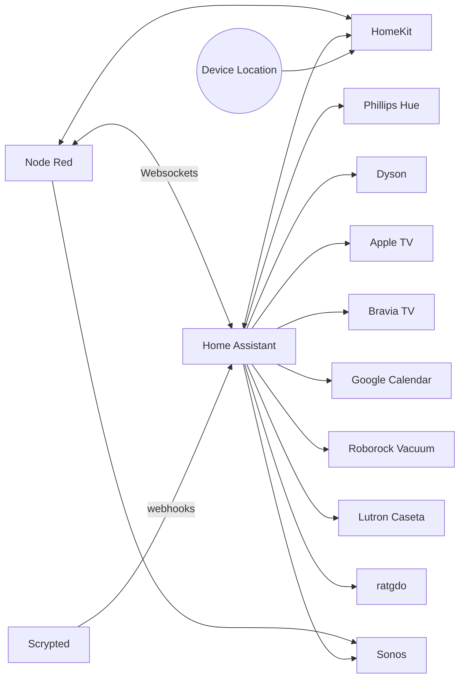

Node Red Flows for Home Automation
========

## Intro

### About

This repo contains my home automations which are executed on [Node Red](https://nodered.org/). Many integrations interact with [Home Assistant](https://www.home-assistant.io/) which is used to interface with various devices.

These are public in case they are interesting or even useful to someone else, so that I can ask help from other home automation enthusiasts, and show off a bit.

[All Node Red Modules used are incidentally listed here](package.json) as part of the Node Red project.

### Components


### Taking a look at the nodes interactively
If you would like to see what these nodes look like in a local instance of Node Red, clone this repository and run:
```
make
```
That should create an instance of Node Red with all of these flows at [http://127.0.0.1:8080](http://127.0.0.1:8080).

The dependencies for doing this are:
- GNU Make
- Docker

When you're done you can run a cleanup with:
```
make cleanup
```
This should cleanup any remaining containers or networks; it does not attempt to cleanup the container images which were created.

### Installing this project in an instance of Node Red
The Node Red flows in this repository are updated and published using Node Red's [Projects feature](https://nodered.org/docs/user-guide/projects/). Although there's a bunch of extra stuff in the repository, it should still be possible to [use their instructions to clone this repository into an instance of Node Red](https://nodered.org/docs/user-guide/projects/#clone-a-project-repository).

## My Flows

### Music - Sonos
Sonos speakers play audio ambiently at basically all times. Different playback behavior is defined in [music_config.yaml](configs/music_config.yaml) and activated by this flow.

Music config remains quite complex, and is actually flattened out in the longest `function` node in the whole setup. This file remains the point of modification for music configuration. Playlist can be tried out directly through the Sonos app or Spotify, but then get added in a [small PR to this repository](https://github.com/NickBorgers/node-red/pull/3/files).


### Lighting Control
A blend of Lutron Caseta and Phillips Hue lights are used to provide accent and ambient lighting in the home. Task lighting is entirely separate and uses manually switched lights. Some conditional behavior is driven by [hue_config.yaml](configs/hue_config.yaml) but a scene in the Hue system must exist for activation based on the "day phase" of the home.

Hue config got significantly less complex when I adopted Home Assistant, as it has wonderful Hue integration which allowed me to key off the string names of the scenes for each Hue "room" in the home. At this point, modifying the lighting of a scene is done directly through the Hue App and you just save the Scene with the name matching which "Home Day Phase" it is for, e.g. `Morning`.


### Configuration - Music and Lights
I wanted to be able to git track the fairly complex configuration objects that I needed to describe my intents for music playback and lighting. These were the first files in this repository to be source controlled. Those configuration objects take the form of YAML files:
  - [hue_config.yaml](configs/hue_config.yaml)
  - [music_config.yaml](configs/music_config.yaml)
  - [schedule_config.yaml](configs/schedule_config.yaml)

[The config files are validated for YAML correctness using `yamllint` in a GitHub Action](.github/workflows/validate.yml#10-24). Because the majority of music playback leverages public Spotify playlists, the [music_config.yaml](configs/music_config.yaml) gets some additional validation by a [script which confirms every indicated Spotify Playback URI is a valid, reachable, and public Spotify Playlist](config-test/validate_spotify_uris.py).

The Node Red Flow which manages Configuration is:


### State Tracking
Responding to the occupants of the home requires tracking state, largely facilitated with Homekit presence tracking and a pair of door sensors. The behavior of the home varies depending on whether or not a guest is present, so that manifests as a manually-switched configuration controlled via Homekit.


### Sleep Hygiene
We're working on sleep hygiene right now and have enslisted the home automation to help.


### TV Monitoring and Manipulation
When we watch something on the TV we want the nearby speakers to mute. So, we monitor what's going on with the TV itself and the associated Apple TV to drive some automations.


### Energy State
We have an electrical energy generation, storage, and backup system. To summarize the state of this system and drive automations, I configured a "level" concept in:
  - [energy_config.yaml](configs/energy_config.yaml)

We additionally get free energy at night, and so have an override of energy level if infinite free electricity is available.


### Load Shedding
To better utilize our backup energy supply I have implemented some load shedding beyond what our [SPAN panels provide](https://www.span.io/panel). In particular HVAC is our largest use of energy by far, and widening temperature ranges can save a huge amount of energy. Thus, if we reach certain energy levels we should either widen our temperature range to save energy or resume our "comfort" mode.


### Security
Based on Apple Homekit presence detection and/or everyone going to sleep, lock down the house or open the garage door if someone is returning and the garage is open (thanks [ratgdo](https://ratcloud.llc/)).

This also includes the doorbell notification driven from Scrypted. And most recently is trying to have a trigger we can activate with a Siri command of "Turn on expecting someone" to then cause a notification when a vehicle arrives.


